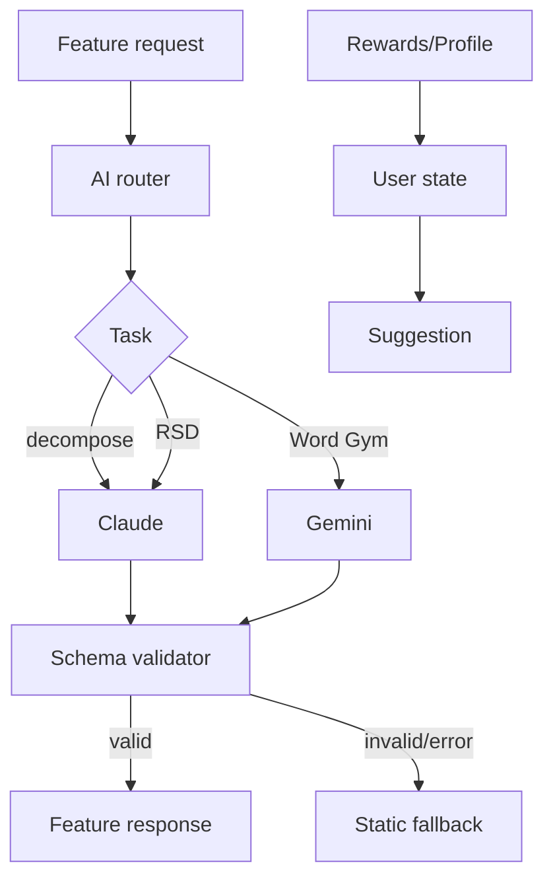

# AI Layer Architecture

```mermaid
flowchart TD
  A["Feature request"] --> B["AI router"]
  B --> C{"Task"}
  C -->|decompose| D["Claude"]
  C -->|RSD| D
  C -->|Word Gym| E["Gemini"]
  D --> F["Schema validator"]
  E --> F
  F -->|valid| G["Feature response"]
  F -->|invalid/error| H["Static fallback"]
  I["Rewards/Profile"] --> J["User state"]
  J --> K["Suggestion"]
```

The router owns provider choice. Features should not call provider SDKs directly.
