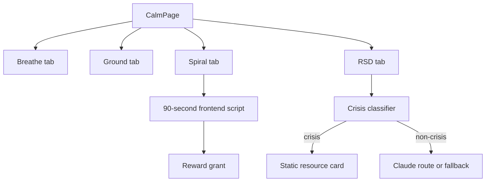

# Calm Zone Architecture

```mermaid
flowchart TD
  A["CalmPage"] --> B["Breathe tab"]
  A --> C["Ground tab"]
  A --> D["Spiral tab"]
  A --> E["RSD tab"]
  E --> F["Crisis classifier"]
  F -->|crisis| G["Static resource card"]
  F -->|non-crisis| H["Claude route or fallback"]
  D --> I["90-second frontend script"]
  I --> J["Reward grant"]
```

Only RSD free text reaches the backend. Breath, grounding, and spiral stop are frontend-led.
