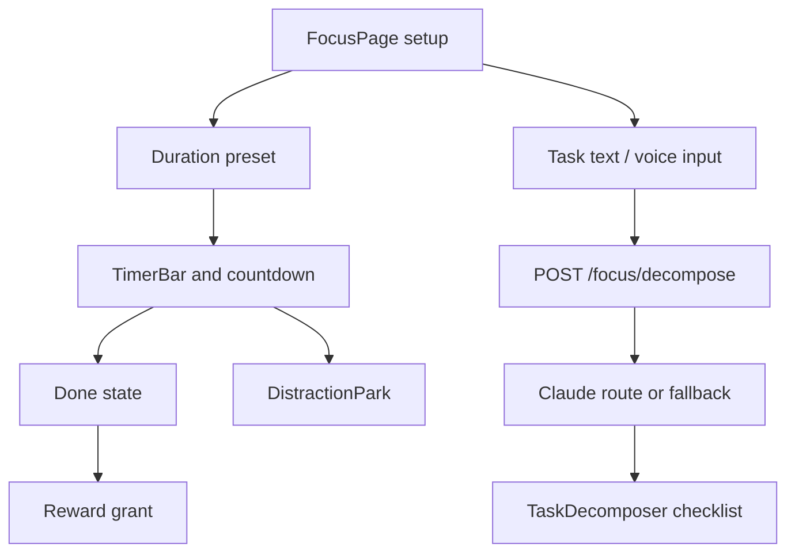

# Focus Architecture

```mermaid
flowchart TD
  A["FocusPage setup"] --> B["Duration preset"]
  A --> C["Task text / voice input"]
  C --> D["POST /focus/decompose"]
  D --> E["Claude route or fallback"]
  E --> F["TaskDecomposer checklist"]
  B --> G["TimerBar and countdown"]
  G --> H["Done state"]
  H --> I["Reward grant"]
  G --> J["DistractionPark"]
```

The timer is frontend-owned. AI decomposition is optional; focus still works with fallback steps.
