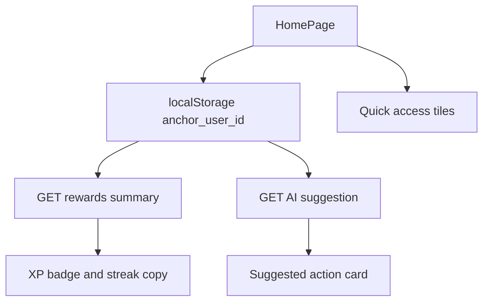

# Home Architecture

```mermaid
flowchart TD
  A["HomePage"] --> B["localStorage anchor_user_id"]
  B --> C["GET rewards summary"]
  B --> D["GET AI suggestion"]
  C --> E["XP badge and streak copy"]
  D --> F["Suggested action card"]
  A --> G["Quick access tiles"]
```

Home remains useful without a user ID by showing a stable local baseline.
