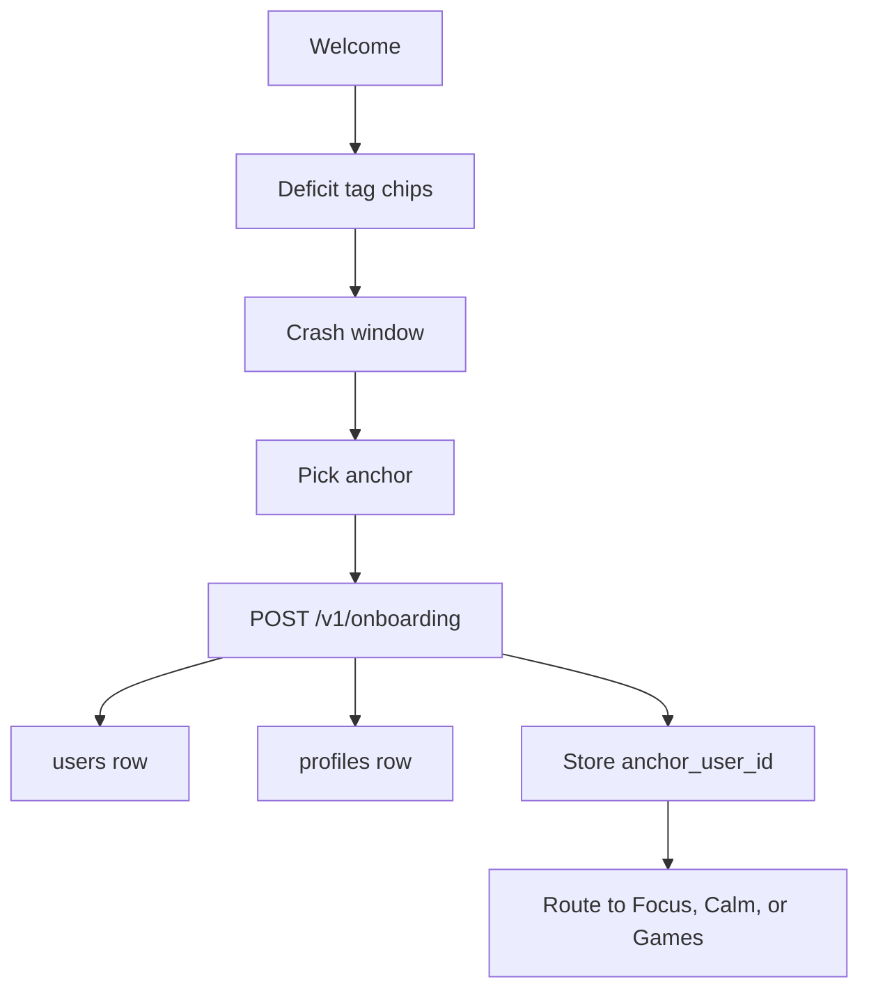

# Onboarding Architecture

```mermaid
flowchart TD
  A["Welcome"] --> B["Deficit tag chips"]
  B --> C["Crash window"]
  C --> D["Pick anchor"]
  D --> E["POST /v1/onboarding"]
  E --> F["users row"]
  E --> G["profiles row"]
  E --> H["Store anchor_user_id"]
  H --> I["Route to Focus, Calm, or Games"]
```

The profile is the first personalization input for later suggestion and user-state logic.
