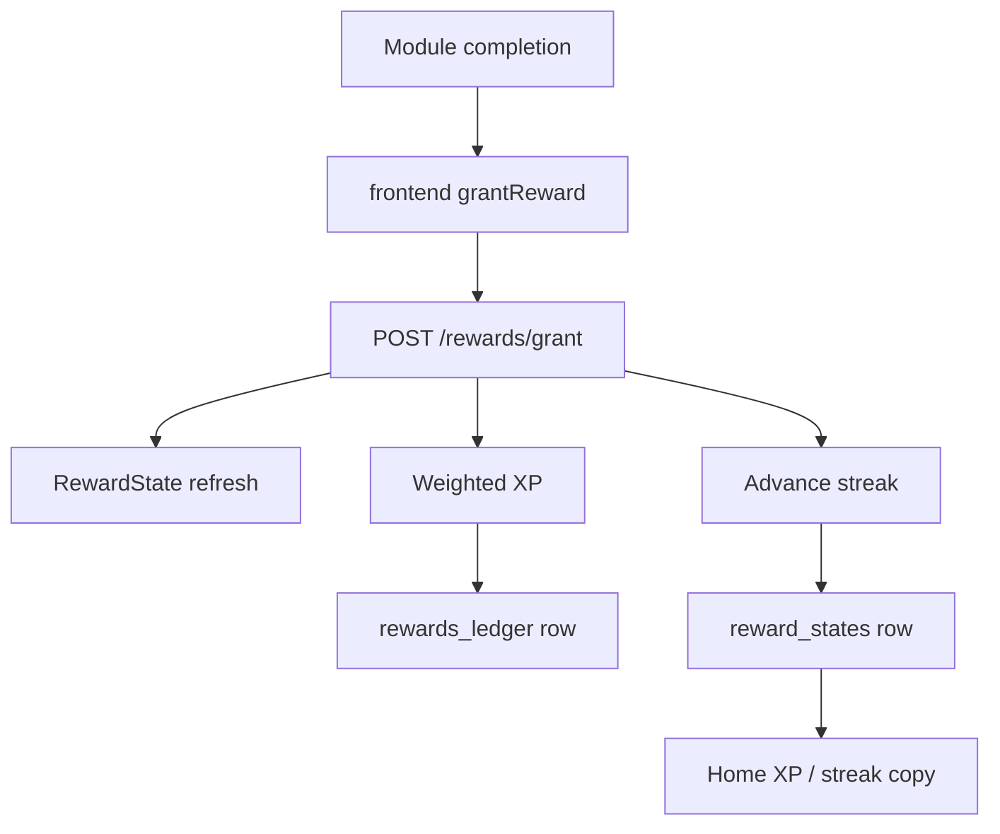

# Rewards Architecture

```mermaid
flowchart TD
  A["Module completion"] --> B["frontend grantReward"]
  B --> C["POST /rewards/grant"]
  C --> D["RewardState refresh"]
  C --> E["Weighted XP"]
  E --> F["rewards_ledger row"]
  C --> G["Advance streak"]
  G --> H["reward_states row"]
  H --> I["Home XP / streak copy"]
```

`rewards_ledger` is the audit trail. `reward_states` is the current state cache.
