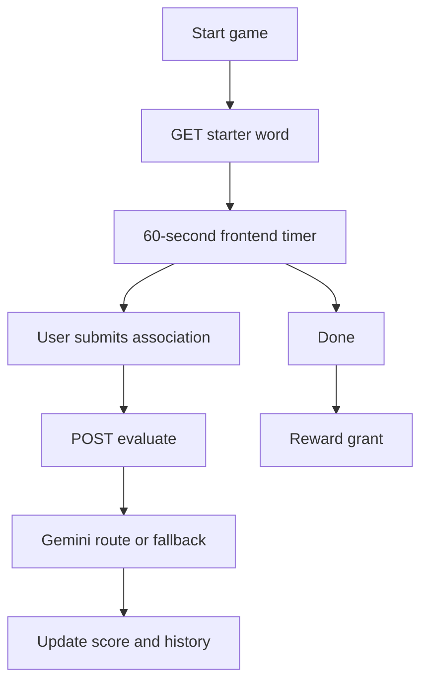

# Word Gym Architecture

```mermaid
flowchart TD
  A["Start game"] --> B["GET starter word"]
  B --> C["60-second frontend timer"]
  C --> D["User submits association"]
  D --> E["POST evaluate"]
  E --> F["Gemini route or fallback"]
  F --> G["Update score and history"]
  C --> H["Done"]
  H --> I["Reward grant"]
```

The game keeps the round state in React and only uses the backend for starter words and evaluation.
